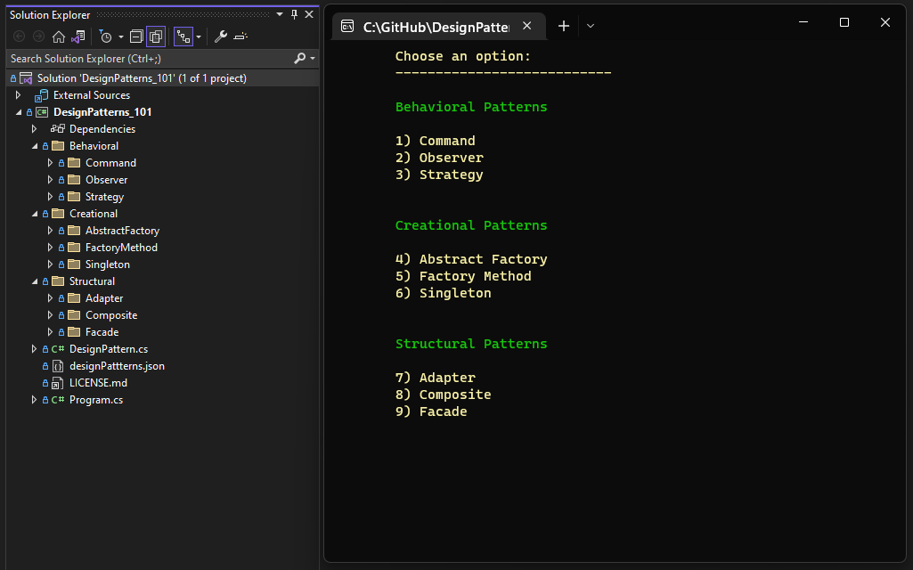

# DesignPatterns_101
A fun and extensible collection of the most used design patterns proposed in the book `Design Patterns: Elements of Reusable Object-Oriented Software`, from the famous Gang of Four.

 
Implement new design patterns following the folder structure and fill-out the designPatterns.json to generate the UI.

 

 

## What do you need to run it

- The latest <a href="https://dotnet.microsoft.com/download" target="_blank">.NET SDK</a>.

